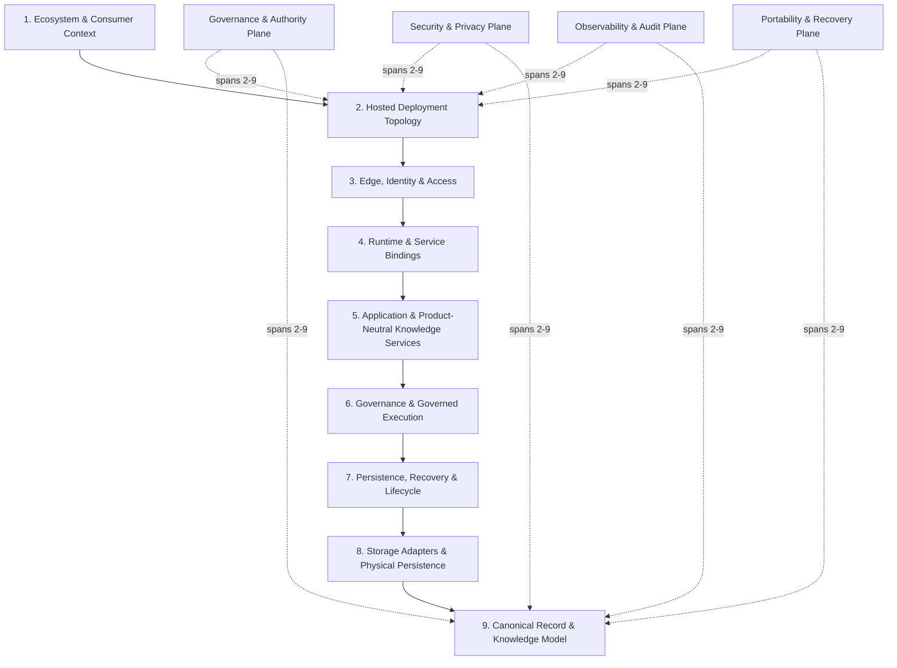

# Enki Knowledge System — Canonical Nine-Layer Architecture

This document defines the corrected architectural decomposition used to reason about Enki without conflating logical layers, deployment topology, provider capabilities, or cross-cutting controls.

The architecture is organized as **nine layers plus four cross-cutting planes**.

## Layer model

| Layer | Name | Purpose |
|---|---|---|
| 1 | Ecosystem & Consumer Context | Humans, source artifacts, external systems, and downstream product suites that interact with Enki. |
| 2 | Hosted Deployment Topology | Cloud/provider placement, trust boundaries, regions, and core hosting surfaces. |
| 3 | Edge, Identity & Access | Ingress, routing, edge security, authentication, authorization, tenant resolution, and execution context. |
| 4 | Runtime & Service Bindings | Request lifecycle, runtime execution, provider bindings, database connectivity, secrets, and optional runtime adapters. |
| 5 | Application & Product-Neutral Knowledge Services | Capture, normalization, state, context, interpretation, retrieval, projection, packaging, and controlled disclosure. |
| 6 | Governance & Governed Execution | Authority, approval, policy, provenance, transactions, reservations, receipts, model-use controls, and governed mutation. |
| 7 | Persistence, Recovery & Lifecycle | Journals, snapshots, replay, retention, reconciliation, backup, recovery, export/import, conflict handling, and audit. |
| 8 | Storage Adapters & Physical Persistence | Relational, object, indexing, caching, serialization, integrity, and provider-specific persistence adapters. |
| 9 | Canonical Record & Knowledge Model | Definitive record families, relationships, temporal semantics, lineage, schema evolution, and integrity metadata. |

## Layer 1 — Ecosystem & Consumer Context

Enki receives source material and governed human inputs and exposes reusable knowledge capabilities to independent downstream suites.

Examples:

- Human operators, reviewers, stewards, and decision-makers
- Documents, conversations, observations, evidence, feedback, and structured data
- External APIs, systems, and partner integrations
- Media Blitz
- Career Intelligence and Placement
- Personal Cognitive Continuity
- Research and executive decision support

Downstream suites remain consumers. They do not define Enki core product boundaries.

## Layer 2 — Hosted Deployment Topology

Defines where Enki executes and where authoritative data is held.

For the `CF-NEON-R2` candidate:

- Cloudflare Workers: compute and edge runtime
- Neon Postgres: canonical structured data
- Cloudflare R2: object evidence and package storage

Provider services beyond this core are optional until explicitly adopted.

## Layer 3 — Edge, Identity & Access

Responsibilities include:

- TLS termination and ingress
- DNS and routing
- WAF and rate limiting
- authentication and authorization
- tenant, namespace, subject, domain, and audience resolution
- TEST versus PRODUCTION execution-context separation
- request validation and throttling

## Layer 4 — Runtime & Service Bindings

Responsibilities include:

- request routing
- context resolution
- middleware
- handlers
- response orchestration
- Neon connectivity
- R2 object access
- secret bindings
- optional queue/cache/coordination adapters

Optional provider features are not assumed core architecture.

## Layer 5 — Application & Product-Neutral Knowledge Services

Core Enki services remain generic and reusable:

- capture and ingestion
- entity and relationship normalization
- knowledge-state management
- contextual state
- interpretation
- retrieval and search
- projection and view generation
- packaging
- governed disclosure and delivery

Product-specific career, media, or personal-lifecycle capabilities remain outside Enki core.

## Layer 6 — Governance & Governed Execution

All canonical mutation and governed action passes through explicit control mechanisms:

- authority and approval grants
- policy evaluation
- provenance and lineage
- transaction coordination
- reservations and conflict prevention
- receipts and attestations
- model-ingestion and model-feedback controls
- revocation, consumption, retry, rollback, and recovery semantics

No direct canonical writes are permitted outside governed paths.

## Layer 7 — Persistence, Recovery & Lifecycle

Responsibilities include:

- append-only journals
- snapshots and checkpoints
- deterministic replay
- forensic reconstruction
- retention and archival
- tombstoning and redaction
- recovery and reconciliation
- conflict handling
- backup and export/import
- audit and compliance evidence

Historical truth is preserved even when current authority changes.

## Layer 8 — Storage Adapters & Physical Persistence

Physical-provider implementation is isolated behind adapters.

Core adapters for `CF-NEON-R2`:

- Neon relational adapter
- R2 object adapter

Optional adapters may include:

- search indexes
- caches
- queues
- coordination stores

Adapter adoption must not create a second uncontrolled source of canonical truth.

## Layer 9 — Canonical Record & Knowledge Model

The lowest logical layer defines stable record families and relationships.

Representative families include:

- Tenant / namespace
- Domain
- Subject
- Source
- Artifact
- Assertion
- Evidence
- Confidence
- Interpretation
- Context
- Authority state
- Approval grant
- Transition
- Provenance
- Lineage
- Policy
- Reconciliation finding
- Disclosure receipt
- Transaction journal
- Reservation
- Transaction receipt
- Model-ingestion policy
- Model-feedback receipt
- Work-control record
- Sprint record
- Retention / tombstone state
- Snapshot / checkpoint
- Conflict record
- Recovery record
- Audit event

Temporal semantics must distinguish, as applicable:

- `recorded_at`
- `effective_from`
- `effective_to`
- `superseded_at`
- authority-valid time
- revocation and consumption time

## Cross-cutting planes

### Governance & Authority Plane

Spans Layers 2–9 and governs authorization, approval, policy, delegation, revocation, decision rights, and human authority.

### Security & Privacy Plane

Spans Layers 2–9 and governs identity, tenant and subject isolation, secrets, encryption, consent, privacy, redaction, disclosure scope, and least privilege.

### Observability & Audit Plane

Spans Layers 2–9 and provides privacy-preserving metrics, traces, logs, receipts, health signals, forensic reconstruction, and immutable audit evidence.

### Portability & Recovery Plane

Spans Layers 2–9 and governs export/import, backup, disaster recovery, provider exit, replay, reconstruction, rollback, migration, and evidence continuity.

## Architectural invariants

1. Historical truth and current authority remain distinct.
2. Evidence precedes assertion where evidence is required.
3. Human authority remains final for explicitly human-governed decisions.
4. TEST authority cannot satisfy PRODUCTION gates.
5. Canonical mutation is governed, journaled, receipted, and reconstructable.
6. Provider-specific services do not redefine Enki core contracts.
7. Downstream products consume Enki; they do not become Enki core.
8. Canonical structured data has one explicitly designated authority at a time.
9. Object evidence remains distinguishable from structured canonical state.
10. Portability, lineage, auditability, and recoverability are designed in rather than added later.

## Relationship to deployment candidates

This nine-layer model is the architectural frame. Deployment candidates such as `CF-NEON-R2` map provider services onto the frame but do not alter the model unless a separate governed architecture decision changes the canonical architecture.
