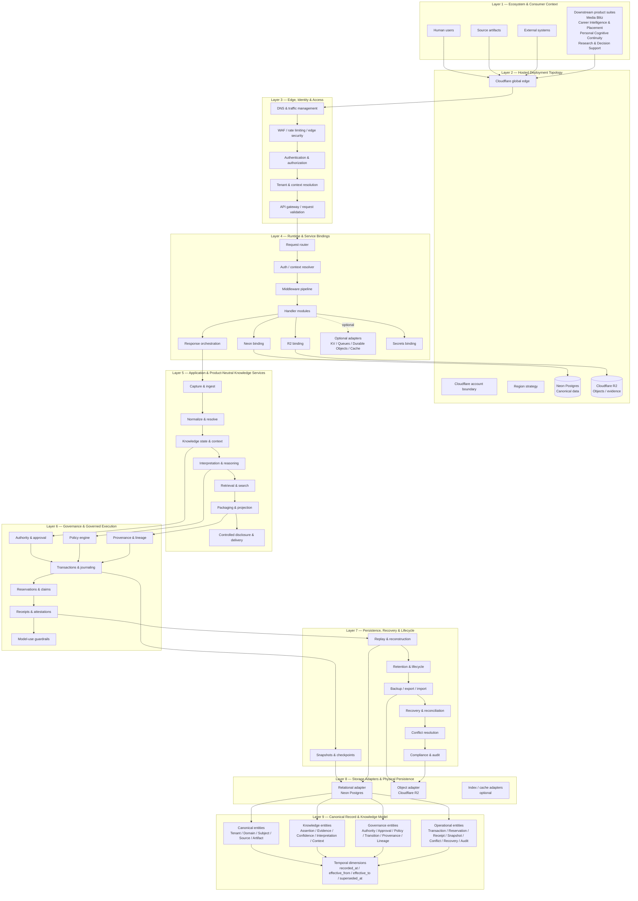

# Enki Knowledge System — Split-Cloud Reference Architecture

Reference architecture: `CF-NEON-R2`

Status: **Architecture documentation only**

Core provider set:

- Cloudflare Workers — compute and edge runtime
- Neon Postgres — canonical structured data
- Cloudflare R2 — evidence, artifacts, packages, exports, and backups

This document is the corrected split-cloud architecture view. Optional provider services are explicitly identified as optional or candidate capabilities and are not implied dependencies of Enki core.

## Cross-cutting planes

The following planes span Layers 2–9 and are **not additional stacked layers**.

### Governance & Authority Plane

Ensures every governed action is authorized, traceable, policy-constrained, and subject to explicit human authority where required.

### Security & Privacy Plane

Covers identity, least privilege, secrets, encryption hooks, tenant and subject isolation, consent, redaction, privacy preservation, and deny-by-default behavior.

### Observability & Audit Plane

Covers privacy-preserving metrics, traces, structured logs, immutable audit evidence, health signals, incident reconstruction, and compliance evidence.

### Portability & Recovery Plane

Covers governed export/import, backup, disaster recovery, replay, deterministic reconstruction, migration, rollback, and provider-exit portability.

## Provider boundary rules

1. Neon Postgres is the canonical structured-data system of record unless a later governed architecture decision explicitly changes that role.
2. Cloudflare R2 stores evidence objects, generated packages, publication assets, exports, recovery bundles, and related object artifacts.
3. D1 is **not** part of the CF-NEON-R2 core architecture.
4. KV, Queues, Durable Objects, Cache, Images, Stream, and similar Cloudflare services are optional candidates only and must earn adoption through a separate architectural decision.
5. No queue or event bus is assumed to be the authoritative canonical mutation path.
6. Downstream product suites consume Enki through governed consumer boundaries; they do not become Enki core domain services.
7. Production infrastructure validation remains separate from architecture documentation and TEST validation.
