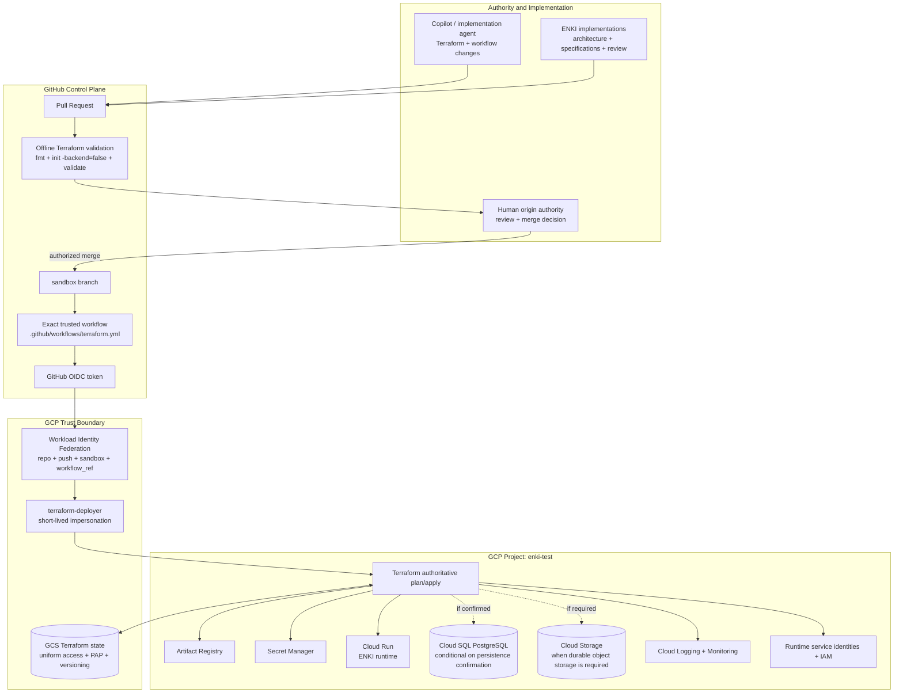
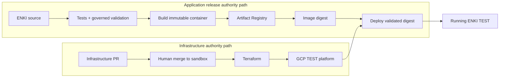
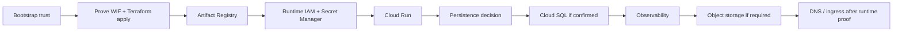
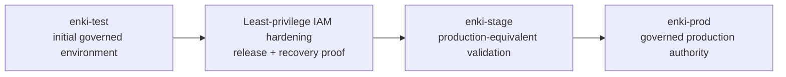

# ENKI GCP TEST Reference Architecture

> **Authority class: Class 3 — architecture documentation.**
> This document records the selected initial hosted TEST topology and authority flow. It does not prove that the depicted GCP resources have been provisioned or validated.

## Status

Selected initial hosted path: **GCP TEST**.

Current state: **prepared in repository, pending bootstrap execution and operational proof**.

The earlier Cloudflare-native and Cloudflare/Neon/R2 architectures remain retained reference alternatives. They are not the selected initial TEST implementation path.

## Control-Plane Architecture

## Runtime and Release Separation

Terraform governs **where ENKI runs**. The application release pipeline governs **which validated ENKI artifact runs there**. These are separate authority paths.

## Initial Resource Sequence

The TEST platform should be introduced incrementally after the control plane is operationally proven:

## Environment Evolution

TEST bootstrap permissions must not be copied into STAGE or PROD without explicit hardening.

## Trust-Boundary Invariants

1. Pull-request workflows receive no GCP deployer identity.
2. The deployer WIF condition requires the exact repository, `push` event, `refs/heads/sandbox`, and exact Terraform workflow reference.
3. A passing PR check does not authorize infrastructure mutation.
4. Human-authorized merge is the TEST authority transition.
5. GitHub Actions receives short-lived authority only; no permanent service-account key is stored in GitHub.
6. Terraform state is protected by uniform bucket access, public-access prevention, and versioning.
7. Application releases deploy validated immutable artifacts rather than rebuilding independently per environment.

## Related Documentation

- `docs/infrastructure/gcp-execution-control-plane.md`
- `docs/roadmaps/gcp-hosted-platform-roadmap.md`
- `docs/governance/architecture-roadmap-synchronization.md`
- `infrastructure/bootstrap/README.md`

## Evidence Boundary

This reference architecture becomes an operationally proven topology only when bootstrap execution, Workload Identity Federation authentication, Terraform apply, and subsequent resource-deployment evidence exist. Until then, it is the selected and prepared architecture, not a claim of deployed state.