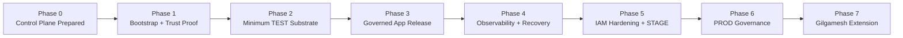

# GCP Hosted Platform Roadmap

> **Authority class: Class 3 — hosted-platform roadmap.**
> This document establishes intended sequencing and milestone criteria. It does not establish implementation truth. Completion requires merged implementation and the appropriate workflow, deployment, or external-system evidence.

## Purpose

Define the staged path from repository-prepared GCP infrastructure control to a governed ENKI TEST environment, then to hardened multi-environment hosting and future Project Gilgamesh platform needs.

## Current Position

As of 2026-07-17, PR #142 prepares the initial GitHub-to-GCP execution control plane and its documentation.

Current phase: **Phase 0 — Control Plane Prepared**.

The control plane is not operational until bootstrap execution and a trusted WIF-authenticated Terraform apply are evidenced.

## TEST Execution Issue Chain

The repo-native TEST runway is represented by the following GitHub issues and is intended to execute continuously once dependencies are satisfied:

1. GCP-01 — Issue #143 — TEST Resource Foundation.
2. GCP-02 — Issue #144 — Enki Container Contract.
3. GCP-03 — Issue #145 — Governed Build and Artifact Publication.
4. GCP-04 — Issue #146 — Persistence Decision Lock. **Sole planned human architecture gate.**
5. GCP-05 — Issue #147 — Hosted Persistence Foundation.
6. GCP-06 — Issue #148 — Hosted Persistence Adapter and Migration Proof.
7. GCP-07 — Issue #149 — Cloud Run Runtime Foundation.
8. GCP-08 — Issue #150 — Enki TEST Application Deployment Pipeline.
9. GCP-09 — Issue #151 — First Enki Hosted Boot. No human approval gate.
10. GCP-10 — Issue #152 — Hosted Functional Smoke Suite.
11. GCP-11 — Issue #153 — Observability and Runtime Identity.
12. GCP-12 — Issue #154 — Restart, Rollback, Backup, and Recovery Proof.
13. GCP-13 — Issue #155 — Security and Authority Regression.
14. GCP-14 — Issue #156 — TEST Drift and State Reconciliation.
15. GCP-15 — Issue #157 — TEST Completion Gate.

GCP-00 is represented by PR #142 and its required no-op trust proof. GCP-01 begins immediately when that proof succeeds. Outside GCP-04, execution continues automatically unless a genuine external capability failure, failed invariant requiring a consequential decision, or an explicit human-authority boundary is reached.

## Roadmap

### Phase 0 — Control Plane Prepared

Status: **Prepared in PR #142; pending merge and external bootstrap evidence**

Deliverables:

- convergent GCP bootstrap script;
- GCS Terraform state foundation;
- GitHub OIDC to GCP Workload Identity Federation trust;
- deployer identity restricted to exact repository, event, branch, and workflow;
- PR validation without GCP credentials;
- serialized Terraform apply after authorized merge to `sandbox`;
- architecture, diagram, roadmap, and operating-model documentation.

Exit criteria:

- documentation and control-plane code merged to `sandbox`;
- no unresolved structural security blocker.

### Phase 1 — Bootstrap and Trust Proof

Status: **Next**

Deliverables:

- `enki-test` GCP project confirmed with billing;
- bootstrap script completes successfully;
- five GitHub Actions variables configured;
- trusted Terraform workflow obtains short-lived GCP authority through WIF;
- authoritative Terraform plan/apply completes;
- execution evidence captured.

Exit criteria:

- repository-to-GCP execution bridge is operationally proven.

### Phase 2 — Minimum ENKI TEST Substrate

Status: **Planned**

Deliverables, introduced as governed infrastructure packets:

1. Artifact Registry.
2. Runtime service identity and minimum IAM bindings.
3. Secret Manager resources and access bindings.
4. Cloud Run service shell.
5. Persistence decision confirmed.
6. Cloud SQL PostgreSQL only if the runtime persistence contract confirms relational PostgreSQL requirements.
7. Cloud Storage only where durable object storage is required.

Exit criteria:

- ENKI can run in GCP TEST with required secrets and persistence boundaries;
- restart does not destroy durable state;
- infrastructure remains reproducible through Terraform.

### Phase 3 — Governed Application Release Pipeline

Status: **Planned**

Deliverables:

- application tests and governed validation;
- immutable container build;
- Artifact Registry push;
- image digest capture;
- deployment by immutable digest to Cloud Run TEST;
- release metadata exposing commit, release identifier, and artifact digest;
- smoke and integration validation after deployment.

Exit criteria:

- infrastructure deployment and application release are separate authority paths;
- running ENKI TEST can identify exactly which validated artifact is deployed.

### Phase 4 — Observability, Recovery, and Operating Proof

Status: **Planned**

Deliverables:

- structured logs;
- request and correlation identifiers;
- Cloud Monitoring health and failure signals;
- alerting for actionable operational failures;
- Cloud SQL backup/restore proof if Cloud SQL is adopted;
- deployment and recovery evidence;
- operational runbooks.

Exit criteria:

- operators can determine whether ENKI is healthy, what version is running, why it failed, and how to recover it.

### Phase 5 — IAM Hardening and STAGE Readiness

Status: **Planned**

Deliverables:

- replace TEST bootstrap `roles/editor`, `roles/iam.securityAdmin`, and `roles/resourcemanager.projectIamAdmin` grants with resource-specific least-privilege permissions;
- separate environment trust and state boundaries;
- establish `enki-stage` only after hardening;
- production-equivalent release validation;
- artifact promotion without environment-specific rebuilds.

Exit criteria:

- STAGE does not inherit TEST bootstrap privilege;
- promotion moves the same validated artifact forward.

### Phase 6 — PROD Authority and Release Governance

Status: **Future**

Deliverables:

- `enki-prod` project and isolated authority boundary;
- explicit production approval gate;
- hardened secrets, IAM, recovery, audit, and incident procedures;
- production deployment receipts and immutable release identity;
- rollback and recovery validation.

Exit criteria:

- production mutation authority is explicitly governed and independently auditable.

### Phase 7 — Project Gilgamesh Platform Extension

Status: **Future**

Gilgamesh should inherit the proven ENKI platform machinery rather than create a separate deployment system.

Expected additional requirements include:

- person-scoped identity and authorization;
- consent and revocation;
- privacy and retention controls;
- stronger subject isolation;
- encryption and key-custody decisions;
- portability and deletion guarantees;
- person-object lifecycle auditability.

Exit criteria:

- Gilgamesh-specific controls extend the ENKI platform without weakening ENKI's governance, provenance, release, or authority boundaries.

## Roadmap Diagram

## Governing Rules

1. Do not provision the full platform in one monolithic infrastructure change.
2. Do not claim a phase complete without the evidence required by its exit criteria.
3. Keep TEST, STAGE, and PROD authority and state boundaries distinct.
4. Do not carry broad TEST bootstrap IAM into STAGE or PROD.
5. Infrastructure changes must update relevant architecture diagrams and roadmap documentation in the same change set.
6. Application releases must promote immutable validated artifacts rather than rebuild independently per environment.

## Related Documentation

- `docs/architecture/gcp-test-reference-architecture.md`
- `docs/infrastructure/gcp-execution-control-plane.md`
- `docs/governance/architecture-roadmap-synchronization.md`
- `roadmap/platform-capability-roadmap.md`
